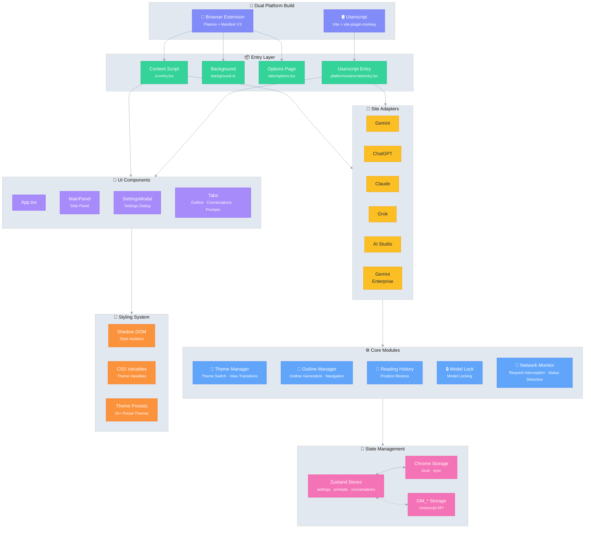

# Ophel Atlas 🚀

> Transformez les conversations IA en documents lisibles, navigables et réutilisables

<div align="center">
  

  <h3 style="margin-top: -2px;">✨ Transformez les conversations en connaissances, pas seulement en historique ✨</h3>
  
  <p>
    Fini de se perdre dans le défilement infini. Clarifiez le contexte avec des plans en temps réel, construisez votre système avec des dossiers de conversation, affinez l'expérience avec la bibliothèque de prompts, et laissez les pensées brillantes couler librement dans l'ordre.
  </p>
  
  <p align="center" style="font-size: 12px; color: #555;">👇 Démo : De "l'historique de chat à défilement infini" aux "documents IA navigables"</p>

  
  
  <p>
    <strong><em>Faire du chat IA un flux de travail véritablement organisable pour la première fois</em></strong><br/>
  </p>

  <small style="opacity: 0.6;">
  Peu importe la plateforme que vous utilisez, Ophel vous permet d'organiser les conversations en flux de travail réutilisables avec une expérience cohérente et unifiée.
  </small>
  <p>
    <a href="https://chatgpt.com"></a>
    <a href="https://gemini.google.com"></a>
    <a href="https://grok.com"></a>
    <a href="https://claude.ai"></a>
    <a href="https://aistudio.google.com"></a>
    <a href="https://business.gemini.google/"></a>
    <a href="https://github.com/urzeye/ophel/issues"></a>
    </br>
    
    <a href="../../LICENSE"></a>
    
    <a href="https://github.com/urzeye/ophel/stargazers"></a>
    <a href="https://github.com/urzeye/ophel/network/members"></a>
    </br>
    <a href="https://chromewebstore.google.com/detail/ophel-ai-%E5%AF%B9%E8%AF%9D%E5%A2%9E%E5%BC%BA%E5%B7%A5%E5%85%B7/lpcohdfbomkgepfladogodgeoppclakd"></a>
    <a href="https://addons.mozilla.org/zh-CN/firefox/addon/ophel-ai-chat-enhancer/"></a>
    <a href="https://greasyfork.org/zh-CN/scripts/563646-ophel-ai-chat-page-enhancer"></a>
  </p>

</div>

<!-- Promo Link -->
<p align="center">
  📣 <a href="https://github.com/urzeye/ophel/issues/30">
    <strong>Help promote Ophel Atlas</strong>
  </a>
  <br/>
  <a href="https://www.producthunt.com/products/ophel?embed=true&utm_source=badge-featured&utm_medium=badge&utm_campaign=badge-ophel" target="_blank" rel="noopener noreferrer"></a>
</p>

<p align="center">
  <a href="#-démo">Démo</a> •
  <a href="#-fonctionnalités-clés">Fonctionnalités Clés</a> •
  <a href="#-démarrage-rapide">Démarrage Rapide</a> •
  <a href="#%EF%B8%8F-architecture">Architecture</a> •
  <a href="#-soutien">Soutien</a>
</p>

<p align="center">
  🌐 <a href="../../README_EN.md">English</a> | <a href="../../README.md">简体中文</a> | <a href="./README_zh-TW.md">繁體中文</a> | <a href="./README_ja.md">日本語</a> | <a href="./README_ko.md">한국어</a> | <a href="./README_de.md">Deutsch</a> | <strong>Français</strong> | <a href="./README_es.md">Español</a> | <a href="./README_pt.md">Português</a> | <a href="./README_ru.md">Русский</a>
</p>

## 📹 Démo

|                                                          Outline                                                           |                                                       Conversations                                                        |                                                          Features                                                          |
| :------------------------------------------------------------------------------------------------------------------------: | :------------------------------------------------------------------------------------------------------------------------: | :------------------------------------------------------------------------------------------------------------------------: |
| <video src="https://github.com/user-attachments/assets/a40eb655-295e-4f9c-b432-9313c9242c9d" width="280" controls></video> | <video src="https://github.com/user-attachments/assets/a249baeb-2e82-4677-847c-2ff584c3f56b" width="280" controls></video> | <video src="https://github.com/user-attachments/assets/6dfca20d-2f88-4844-b3bb-c48321100ff4" width="280" controls></video> |

## 🎯 Cas d’usage

- Apprentissage et recherche : raisonnement sur longues conversations, organiser les connaissances, relire les conclusions, extraire des notes
- Travail au quotidien : découpage des besoins, rédaction de solutions, analyse concurrentielle, comptes rendus de réunion, workflows de conseil et de management
- Développement et rédaction technique : longues discussions de code, triage de bugs, exploration d’architecture, documentation/blog
- Création de contenu : itérer scripts/plans/révisions, revenir vite aux passages clés et exporter pour retravailler
- Utilisateurs intensifs d’IA : besoin de structure, d’ordre et de réutilisation, pas seulement de chats ponctuels

## ✨ Fonctionnalités Clés

- 🧠 **Smart Outline** — Analyse automatique des requêtes utilisateur et réponses IA en structure navigable
- 💬 **Conversation Manager** — Dossiers, tags, recherche, opérations par lot
- ⌨️ **Prompt Library** — Variables, prévisualisation Markdown, catégories, insertion en un clic
- 🎨 **Personnalisation de Thème** — 20+ thèmes sombres/clairs, CSS personnalisé
- 🔧 **Optimisation UI** — Mode écran large, contrôle de largeur, mise en page latérale
- 📖 **Expérience de Lecture** — Verrouillage du défilement, restauration de l'historique, rendu Markdown
- ⚡ **Outils de Productivité** — Raccourcis, verrouillage de modèle, renommage automatique, notifications
- 🎭 **Amélioration Claude** — Gestion de clé de session, changement multi-compte
- 🔒 **Confidentialité d'Abord** — Stockage local, sync WebDAV, aucune collecte de données

<details>
<summary>Confidentialité & données (déplier)</summary>

**Ophel Atlas** place la confidentialité au premier plan : stockage local par défaut, vos données restent sous votre contrôle.

- **Stockage local par défaut :** réglages, prompts et données de gestion des conversations sont stockés dans le navigateur
- **Sans compte :** aucune inscription nécessaire
- **Permissions à la demande :** permissions optionnelles demandées uniquement si nécessaire, révocables à tout moment (voir la page Permissions de l’extension)
- **Synchronisation WebDAV optionnelle :** utilisez votre propre WebDAV pour plusieurs appareils (contrôlable, portable)
- **Export & sauvegarde :** export et migration pour éviter le verrouillage

</details>

> Note : la prise en charge de sites d’IA spécifiques dépend du matching du site et des changements de structure des pages.

## 🚀 Démarrage Rapide

> [!tip]
>
> **Nous recommandons fortement d'utiliser la version Extension de Navigateur** pour un ensemble de fonctionnalités plus complet, une meilleure expérience et une compatibilité plus élevée. La version Userscript a des limitations.

### Web Store

<a href="https://chromewebstore.google.com/detail/ophel-ai-%E5%AF%B9%E8%AF%9D%E5%A2%9E%E5%BC%BA%E5%B7%A5%E5%85%B7/lpcohdfbomkgepfladogodgeoppclakd"></a>
<a href="https://addons.mozilla.org/zh-CN/firefox/addon/ophel-ai-chat-enhancer/"></a>
<a href="https://greasyfork.org/zh-CN/scripts/563646-ophel-ai-chat-page-enhancer"></a>

### Installation Manuelle

#### Extension de Navigateur

1. Téléchargez et décompressez depuis [Releases](https://github.com/urzeye/ophel/releases/latest)
2. Ouvrez la page de gestion des extensions du navigateur, activez le **Mode développeur**
3. Cliquez sur **Charger l'extension non empaquetée** et sélectionnez le dossier décompressé

#### Userscript

1. Installez [Tampermonkey](https://www.tampermonkey.net/)
2. Téléchargez le fichier `.user.js` depuis [Releases](https://github.com/urzeye/ophel/releases)
3. Faites glisser dans le navigateur ou cliquez sur le lien pour installer

### Build Local

<details>
<summary>Cliquez pour étendre les étapes de build</summary>

**Prérequis**: Node.js >= 20.x, pnpm >= 9.x

```bash
git clone https://github.com/urzeye/ophel.git
cd ophel

pnpm install
pnpm dev              # Mode développement
pnpm build            # Build production Chrome/Edge
pnpm build:firefox    # Build production Firefox
pnpm build:userscript # Build production Userscript
```

</details>

## 🏗️ Architecture

**Stack Technique**: [Plasmo](https://docs.plasmo.com/) + [React](https://react.dev/) + [TypeScript](https://www.typescriptlang.org/) + [Zustand](https://github.com/pmndrs/zustand)

<details>
<summary>📐 Diagramme d'Architecture (cliquer pour étendre)</summary>



</details>

### 🐛 Signaler un Bug

Pour des problèmes ou suggestions, visitez [GitHub Issues](https://github.com/urzeye/ophel/issues).

## ⭐ Star History

<a href="https://star-history.com/#urzeye/ophel&Date">
 <picture>
   <source media="(prefers-color-scheme: dark)" srcset="https://api.star-history.com/svg?repos=urzeye/ophel&type=Date&theme=dark" />
   <source media="(prefers-color-scheme: light)" srcset="https://api.star-history.com/svg?repos=urzeye/ophel&type=Date" />
   
 </picture>
</a>

## 💖 Soutien

<p align="center">
  <em>"If you want to go fast, go alone. If you want to go far, go together."</em>
</p>

<p align="center">
  Si Ophel améliore votre flux de travail, envisagez de soutenir via Star ou Sponsor pour nous aider à aller plus loin.
</p>

<p align="center">
  Made with ❤️ by <a href="https://github.com/urzeye">urzeye</a>
</p>

## 📜 Licence

Ce projet est sous licence **GNU GPLv3**. Voir [LICENSE](../../LICENSE) pour les détails.

