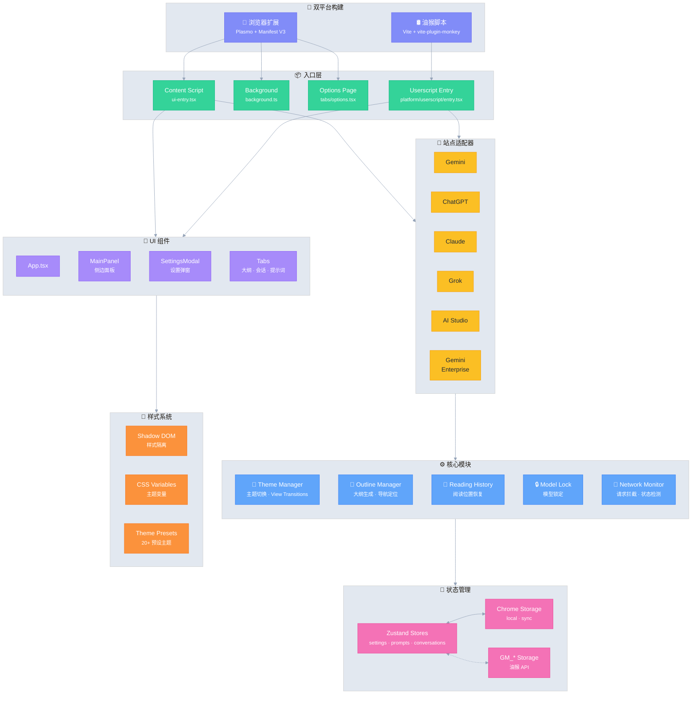

# Ophel Atlas 🚀

> 让 AI 对话如文档般可阅读、导航、复用

<sub>Language: <strong>简体中文</strong> | <a href="./README_EN.md">English</a></sub>

<div align="center">
  

  <h3 style="margin-top: -2px;">✨ 把对话变成知识，而不是历史 ✨</h3>
  
  <p>
    告别无限滚动带来的信息迷航
    </br>
    用实时大纲厘清脉络，
    </br>
    用会话文件夹构筑体系，
    </br>
    用 Prompt 词库沉淀经验，
    </br>
    让那些闪光的思考在秩序中自由流动
  </p>
  
  <sub>👇 Demo: 从“无限滚动的聊天记录”，到“可导航的 AI 文档”</sub>
  
  
  
  <p>
    <strong><em>它让 AI 对话第一次成为可组织的工作流</em></strong><br/>
  </p>

  <small style="opacity: 0.6;">
  无论你使用哪个平台，都可以以同一种方式，获得一致、可组织且可重用的体验
  </small>
  <p>
    <a href="https://gemini.google.com"></a>
    <a href="https://chatgpt.com"></a>
    <a href="https://aistudio.google.com"></a>
    <a href="https://claude.ai"></a>
    <a href="https://grok.com"></a>
    <a href="https://business.gemini.google/"></a>
    <a href="https://github.com/urzeye/ophel/issues"></a>
    <br/>
    <a href="https://chat.deepseek.com"></a>
    <a href="https://www.doubao.com"></a>
    <a href="https://www.kimi.com"></a>
    <a href="https://chat.z.ai"></a>
    <a href="https://chatglm.cn/main/alltoolsdetail?lang=zh"></a>
    <a href="https://chat.qwen.ai"></a>
    <a href="https://www.qianwen.com"></a>
    <a href="https://ima.qq.com"></a>
    </br>
    
    <a href="./LICENSE"></a>
    
    <a href="https://github.com/urzeye/ophel/stargazers"></a>
    <a href="https://github.com/urzeye/ophel/network/members"></a>
    </br>
    <!-- <a href="https://chromewebstore.google.com/detail/ophel-ai-%E5%AF%B9%E8%AF%9D%E5%A2%9E%E5%BC%BA%E5%B7%A5%E5%85%B7/lpcohdfbomkgepfladogodgeoppclakd"></a>
    <a href="https://addons.mozilla.org/zh-CN/firefox/addon/ophel-ai-chat-enhancer/"></a>
    <a href="https://greasyfork.org/zh-CN/scripts/563646-ophel-ai-chat-page-enhancer"></a> -->
    <a href="https://chromewebstore.google.com/detail/ophel-ai-%E5%AF%B9%E8%AF%9D%E5%A2%9E%E5%BC%BA%E5%B7%A5%E5%85%B7/lpcohdfbomkgepfladogodgeoppclakd"></a>
    <a href="https://addons.mozilla.org/zh-CN/firefox/addon/ophel-ai-chat-enhancer/"></a>
    <a href="https://greasyfork.org/zh-CN/scripts/563646-ophel-ai-chat-page-enhancer"></a>
  </p>

</div>

<!-- Promo Link -->
<p align="center">
  📣 <a href="https://github.com/urzeye/ophel/issues/30">
    <strong>Help promote Ophel Atlas / 帮忙宣传 Ophel Atlas</strong>
  </a>
  <br/>
  <a href="https://www.producthunt.com/products/ophel?embed=true&utm_source=badge-featured&utm_medium=badge&utm_campaign=badge-ophel" target="_blank" rel="noopener noreferrer"></a>
</p>

<p align="center">
  <a href="#-功能演示">功能演示</a> •
  <a href="#-核心功能">核心功能</a> •
  <a href="#-快速开始">快速开始</a> •
  <a href="#%EF%B8%8F-技术架构">技术架构</a> •
  <a href="#-支持项目">支持项目</a>
</p>

<p align="center">
  🌐 <a href="./README_EN.md">English</a> | <strong>简体中文</strong> | <a href="./docs/i18n/README_zh-TW.md">繁體中文</a> | <a href="./docs/i18n/README_ja.md">日本語</a> | <a href="./docs/i18n/README_ko.md">한국어</a> | <a href="./docs/i18n/README_de.md">Deutsch</a> | <a href="./docs/i18n/README_fr.md">Français</a> | <a href="./docs/i18n/README_es.md">Español</a> | <a href="./docs/i18n/README_pt.md">Português</a> | <a href="./docs/i18n/README_ru.md">Русский</a>
</p>

## 📹 功能演示

|                                                        大纲 Outline                                                        |                                                     会话 Conversations                                                     |                                                       功能 Features                                                        |
| :------------------------------------------------------------------------------------------------------------------------: | :------------------------------------------------------------------------------------------------------------------------: | :------------------------------------------------------------------------------------------------------------------------: |
| <video src="https://github.com/user-attachments/assets/a40eb655-295e-4f9c-b432-9313c9242c9d" width="280" controls></video> | <video src="https://github.com/user-attachments/assets/a249baeb-2e82-4677-847c-2ff584c3f56b" width="280" controls></video> | <video src="https://github.com/user-attachments/assets/6dfca20d-2f88-4844-b3bb-c48321100ff4" width="280" controls></video> |

## 🎯 适用场景

- 学习与研究：长对话推理、整理知识点、复盘结论、提炼笔记
- 日常工作：需求拆解、方案撰写、竞品分析、会议纪要、咨询与管理工作流
- 开发与技术写作：长代码讨论、Bug 排查、架构推演、文档/博客写作
- 内容创作：脚本/大纲/润色反复迭代，快速回到关键段落并导出再加工
- 高频使用 AI 的用户：需要“结构、秩序、复用能力”，而不只是临时聊天

## ✨ 核心功能

- 🧠 **智能大纲** — 自动解析用户问题与 AI 回复，生成可导航的目录结构
- 💬 **会话管理** — 文件夹分类、标签、搜索、批量操作
- ⌨️ **提示词库** — 变量支持、Markdown 预览、分类管理、一键填充
- 🎨 **主题定制** — 20+ 深色/浅色主题，自定义 CSS
- 🔧 **界面优化** — 宽屏模式、页面与用户问题宽度调整、侧边栏布局控制
- 📖 **阅读体验** — 滚动锁定、阅读历史恢复、Markdown 渲染优化
- ⚡ **效率工具** — 快捷键、模型锁定、标签页自动命名、完成通知
- 📊 **使用量预估** — 可选的本地对话计数、Token 粗估与历史统计曲线
- 🎭 **Claude 增强** — Session Key 管理、多账号切换
- 🔒 **隐私优先** — 本地存储、WebDAV 同步、无数据收集

<details>
<summary>隐私与数据（展开说明）</summary>

**Ophel Atlas** 以隐私优先为原则：默认本地存储，你的数据由你掌控。

- **默认本地存储：** 配置、Prompt、会话管理数据等默认保存在浏览器本地
- **无需注册账号：** 不需要创建任何账号即可使用
- **按需授权：** 可选权限在需要时再授权，并可随时撤销（见扩展内 Permissions 页面）
- **可选 WebDAV 同步：** 如果你需要多设备一致，可选择使用你自己的 WebDAV 服务进行同步（可控、可迁移）
- **可导出备份：** 支持导出与迁移，避免被平台绑定

</details>

> 提示：扩展对具体 AI 站点的支持取决于站点匹配与页面结构变化

## 🚀 快速开始

> [!tip]
>
> **推荐使用浏览器扩展（Extension）版本**，功能更全、体验更佳、兼容性更好，油猴脚本版本功能受限。

### 应用商店

<a href="https://chromewebstore.google.com/detail/ophel-ai-%E5%AF%B9%E8%AF%9D%E5%A2%9E%E5%BC%BA%E5%B7%A5%E5%85%B7/lpcohdfbomkgepfladogodgeoppclakd"></a>
<a href="https://addons.mozilla.org/zh-CN/firefox/addon/ophel-ai-chat-enhancer/"></a>
<a href="https://greasyfork.org/zh-CN/scripts/563646-ophel-ai-chat-page-enhancer"></a>

### 手动安装

#### 浏览器扩展

1. 从 [Releases](https://github.com/urzeye/ophel/releases/latest) 下载并解压安装包
2. 打开浏览器扩展管理页面，开启 **开发者模式**
3. 点击 **加载已解压的扩展程序**，选择解压的文件夹

#### 油猴脚本

1. 安装 [Tampermonkey](https://www.tampermonkey.net/) 插件
2. 从 [Releases](https://github.com/urzeye/ophel/releases) 下载 `.user.js` 文件
3. 拖入浏览器或点击链接即可安装

### 本地构建

<details>
<summary>展开查看构建步骤</summary>

**环境要求**：Node.js >= 20.x, pnpm >= 9.x

```bash
git clone https://github.com/urzeye/ophel.git
cd ophel

pnpm install
pnpm dev              # 开发模式
pnpm build            # Chrome/Edge 生产构建
pnpm build:firefox    # Firefox 生产构建
pnpm build:userscript # 油猴脚本生产构建
```

</details>

## 🏗️ 技术架构

**技术栈**：[Plasmo](https://docs.plasmo.com/) + [React](https://react.dev/) + [TypeScript](https://www.typescriptlang.org/) + [Zustand](https://github.com/pmndrs/zustand)

<details>
<summary>📐 架构图（点击展开）</summary>



</details>

### 🐛问题反馈

如有问题或建议，欢迎在 [GitHub Issues](https://github.com/urzeye/ophel/issues) 反馈。

## ⭐ Star History

<a href="https://star-history.com/#urzeye/ophel&Date">
 <picture>
   <source media="(prefers-color-scheme: dark)" srcset="https://api.star-history.com/svg?repos=urzeye/ophel&type=Date&theme=dark" />
   <source media="(prefers-color-scheme: light)" srcset="https://api.star-history.com/svg?repos=urzeye/ophel&type=Date" />
   
 </picture>
</a>

## 💖 支持与致谢

<p align="center">
  <em>"一个人可以走得很快，但一群人可以走得更远。"</em>
</p>

<p align="center">
  感谢 <a href="https://linux.do/">Linux.do</a> 社区的交流与支持，项目的许多想法和改进都来自社区成员的反馈。
</p>

<p align="center">
  如果这款工具对你的工作或学习流程带来提升，欢迎以 Star、Sponsor 的方式支持我们，让 Ophel 变得更好。
</p>

<p align="center">
  Made with ❤️ by <a href="https://github.com/urzeye">urzeye</a>
</p>

## 📜 许可证

本项目采用 **GNU GPLv3** 协议。详情请参阅 [LICENSE](./LICENSE)。
