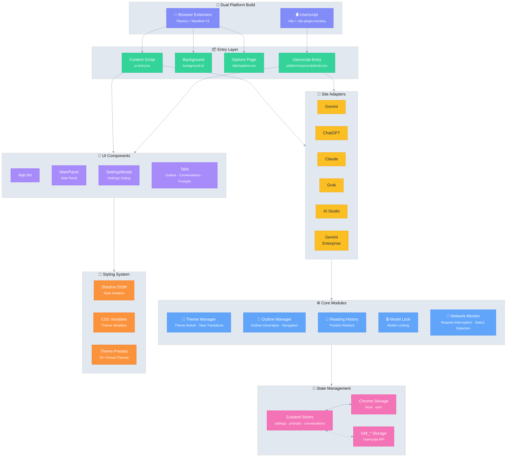

# Ophel Atlas 🚀

> Turn AI chats into documents you can read, navigate, and reuse

Language: **English** | [简体中文](./README.md)

<div align="center">
  

  <h3 style="margin-top: -2px;">✨ Turn Conversations into Knowledge, Not Just History ✨</h3>
  
  <p>
    No more getting lost in endless scroll. Clarify context with real-time Outlines, Build your system with Conversation Folders, Refine experience with the Prompt Library, Let sparkling thoughts flow freely in order.
  </p>
  
  <sub>👇 Demo: From "Infinite Scroll" to "Navigable AI Documents"</sub>
  
  
  
  <p>
    <strong><em>Making AI chat a truly organizeable workflow for the first time</em></strong><br/>
  </p>

  <small style="opacity: 0.6;">
  No matter which of these platforms you use, Ophel lets you organize conversations into reusable workflows with a consistent, unified experience.
  </small>
  <p>
    <a href="https://chatgpt.com"></a>
    <a href="https://gemini.google.com"></a>
    <a href="https://grok.com"></a>
    <a href="https://claude.ai"></a>
    <a href="https://aistudio.google.com"></a>
    <a href="https://business.gemini.google/"></a>
    <a href="https://www.doubao.com"></a>
    <a href="https://github.com/urzeye/ophel/issues"></a>
    </br>
    
    <a href="./LICENSE"></a>
    
    <a href="https://github.com/urzeye/ophel/stargazers"></a>
    <a href="https://github.com/urzeye/ophel/network/members"></a>
    </br>
    <a href="https://chromewebstore.google.com/detail/ophel-ai-%E5%AF%B9%E8%AF%9D%E5%A2%9E%E5%BC%BA%E5%B7%A5%E5%85%B7/lpcohdfbomkgepfladogodgeoppclakd"></a>
    <a href="https://addons.mozilla.org/zh-CN/firefox/addon/ophel-ai-chat-enhancer/"></a>
    <a href="https://greasyfork.org/zh-CN/scripts/563646-ophel-ai-chat-page-enhancer"></a>
  </p>

</div>

<!-- Promo Link -->
<p align="center">
  📣 <a href="https://github.com/urzeye/ophel/issues/30">
    <strong>Help promote Ophel Atlas</strong>
  </a>
  <br/>
  <a href="https://www.producthunt.com/products/ophel?embed=true&utm_source=badge-featured&utm_medium=badge&utm_campaign=badge-ophel" target="_blank" rel="noopener noreferrer"></a>
</p>

<p align="center">
  <a href="#-demo">Demo</a> •
  <a href="#-core-features">Core Features</a> •
  <a href="#-quick-start">Quick Start</a> •
  <a href="#%EF%B8%8F-architecture">Architecture</a> •
  <a href="#-support">Support</a>
</p>

<p align="center">
  🌐 <strong>English</strong> | <a href="./README.md">简体中文</a> | <a href="./docs/i18n/README_zh-TW.md">繁體中文</a> | <a href="./docs/i18n/README_ja.md">日本語</a> | <a href="./docs/i18n/README_ko.md">한국어</a> | <a href="./docs/i18n/README_de.md">Deutsch</a> | <a href="./docs/i18n/README_fr.md">Français</a> | <a href="./docs/i18n/README_es.md">Español</a> | <a href="./docs/i18n/README_pt.md">Português</a> | <a href="./docs/i18n/README_ru.md">Русский</a>
</p>

## 📹 Demo

|                                                          Outline                                                           |                                                       Conversations                                                        |                                                          Features                                                          |
| :------------------------------------------------------------------------------------------------------------------------: | :------------------------------------------------------------------------------------------------------------------------: | :------------------------------------------------------------------------------------------------------------------------: |
| <video src="https://github.com/user-attachments/assets/a40eb655-295e-4f9c-b432-9313c9242c9d" width="280" controls></video> | <video src="https://github.com/user-attachments/assets/a249baeb-2e82-4677-847c-2ff584c3f56b" width="280" controls></video> | <video src="https://github.com/user-attachments/assets/6dfca20d-2f88-4844-b3bb-c48321100ff4" width="280" controls></video> |

## 🎯 Use Cases

- Learning & research: long-form reasoning, organize knowledge, review conclusions, extract notes
- Daily work: requirements breakdown, solution drafting, competitive analysis, meeting notes, consulting & management workflows
- Development & technical writing: long code discussions, bug triage, architecture exploration, docs/blog writing
- Content creation: iterate on scripts/outlines/polish, jump back to key passages, export for reuse
- Power users of AI: need structure, order, and reuse — not just ad-hoc chats

## ✨ Core Features

- 🧠 **Smart Outline** — Auto-parse user queries & AI responses into rich structured outlines
- 💬 **Conversation Manager** — Folders, tags, search, batch operations
- ⌨️ **Prompt Library** — Variables, Markdown preview, categories, one-click insert
- 🎨 **Theme Customization** — 20+ dark/light themes, custom CSS
- 🔧 **UI Optimization** — Widescreen mode, page & bubble width control, sidebar layout
- 📖 **Reading Experience** — Scroll lock, reading history restore, Markdown fixes
- ⚡ **Productivity Tools** — Shortcuts, model lock, tab auto-rename, notifications
- 🎭 **Claude Enhancement** — Session Key management, multi-account switching
- 🔒 **Privacy First** — Local storage, WebDAV sync, no data collection

<details>
<summary>Privacy & Data (expand)</summary>

**Ophel Atlas** puts privacy first: local by default, your data stays in your control.

- **Local by default:** settings, prompts, and conversation management data are stored in your browser
- **No account required:** use it without signing up
- **Permissions on demand:** optional permissions are requested only when needed and can be revoked anytime (see the Permissions page in the extension)
- **Optional WebDAV sync:** use your own WebDAV for multi-device consistency (controllable, portable)
- **Export & backup:** export and migrate to avoid lock-in

</details>

> Note: Support for specific AI sites depends on site matching and page structure changes.

## 🚀 Quick Start

> [!tip]
>
> **We highly recommend using the Browser Extension version** for a more complete feature set, better experience, and higher compatibility. The Userscript version has limitations.

### Web Store

<a href="https://chromewebstore.google.com/detail/ophel-ai-%E5%AF%B9%E8%AF%9D%E5%A2%9E%E5%BC%BA%E5%B7%A5%E5%85%B7/lpcohdfbomkgepfladogodgeoppclakd"></a>
<a href="https://addons.mozilla.org/zh-CN/firefox/addon/ophel-ai-chat-enhancer/"></a>
<a href="https://greasyfork.org/zh-CN/scripts/563646-ophel-ai-chat-page-enhancer"></a>

### Manual Installation

#### Browser Extension

1. Download & unzip from [Releases](https://github.com/urzeye/ophel/releases/latest)
2. Open browser extensions page, enable **Developer mode**
3. Click **Load unpacked** and select the unzipped folder

#### Userscript

1. Install [Tampermonkey](https://www.tampermonkey.net/)
2. Download `.user.js` file from [Releases](https://github.com/urzeye/ophel/releases)
3. Drag into browser or click the link to install

### Local Build

<details>
<summary>Click to expand build steps</summary>

**Requirements**: Node.js >= 20.x, pnpm >= 9.x

```bash
git clone https://github.com/urzeye/ophel.git
cd ophel

pnpm install
pnpm dev              # Development mode
pnpm build            # Chrome/Edge production build
pnpm build:firefox    # Firefox production build
pnpm build:userscript # Userscript production build
```

</details>

## 🏗️ Architecture

**Tech Stack**: [Plasmo](https://docs.plasmo.com/) + [React](https://react.dev/) + [TypeScript](https://www.typescriptlang.org/) + [Zustand](https://github.com/pmndrs/zustand)

<details>
<summary>📐 Architecture Diagram (click to expand)</summary>



</details>

### 🐛 Bug Report

For issues or suggestions, please visit [GitHub Issues](https://github.com/urzeye/ophel/issues).

## ⭐ Star History

<a href="https://star-history.com/#urzeye/ophel&Date">
 <picture>
   <source media="(prefers-color-scheme: dark)" srcset="https://api.star-history.com/svg?repos=urzeye/ophel&type=Date&theme=dark" />
   <source media="(prefers-color-scheme: light)" srcset="https://api.star-history.com/svg?repos=urzeye/ophel&type=Date" />
   
 </picture>
</a>

## 💖 Support

<p align="center">
  <em>"If you want to go fast, go alone. If you want to go far, go together."</em>
</p>

<p align="center">
  If Ophel improves your workflow or learning, please consider supporting via Star or Sponsor to help us go further.
</p>

<p align="center">
  Made with ❤️ by <a href="https://github.com/urzeye">urzeye</a>
</p>

## 📜 License

This project is licensed under **GNU GPLv3**. See [LICENSE](./LICENSE) for details.
